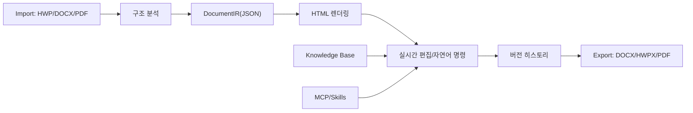
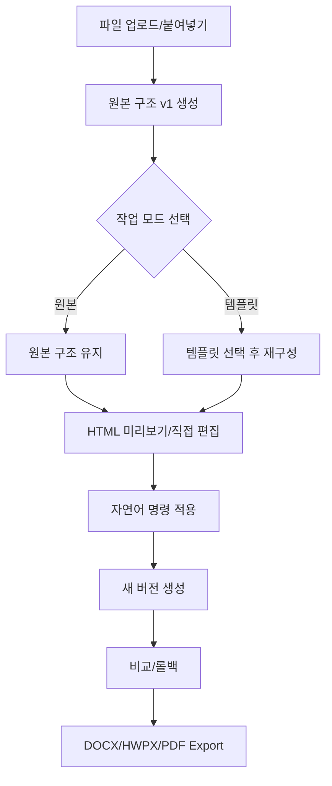

# AI 문서 자동화 시스템 설계

Tidy의 문서 탭은 단순 변환기가 아니라 업로드 문서를 HTML 중심 작업 단위로 바꾸고, 템플릿/자연어 명령/버전/export를 연결하는 AI 문서 자동화 플랫폼으로 설계한다.

## 1. 시스템 아키텍처

핵심 기준은 `DocumentIR(JSON)`과 `HTML`을 함께 유지하는 것이다. HTML은 즉시 렌더링과 편집을 담당하고, DocumentIR은 제목, 문단, 표, 리스트, 강조 요소를 AI와 export 엔진에 안정적으로 전달한다.

## 2. 핵심 기능 모듈

| 모듈 | 역할 | 현재 구현 |
|---|---|---|
| Import Pipeline | HWP, DOCX, PDF를 HTML/text/DocumentIR로 변환 | 문서 탭 PDF import 추가 |
| DocumentIR | 제목, 문단, 표, 리스트, 강조 요소의 중간 표현 | renderer/import 단계에서 생성 |
| Template Engine | 원본 내용을 템플릿 구조에 매핑 | 기본 템플릿, 사용자 저장 템플릿, 인터넷 URL 템플릿 |
| Real-time Editor | iframe contentEditable 기반 HTML 편집 | 직접 수정, 선택 영역 자연어 명령 |
| Version Manager | 버전 저장, 롤백, 비교 | v1 자동 생성, 새 버전 저장, 비교, 롤백 저장 |
| Knowledge Base | 조직명, 부서, 용어집, 프로필 맥락 참조 | 문서 재구성/자연어 수정 프롬프트에 연결 |
| Export Engine | HTML을 DOCX/HWPX/PDF로 변환 | 기존 export 유지, HWPX는 최대 근접 생성 |
| MCP/Skills | 반복 작업 및 외부 확장 | 기존 tidy-skills MCP 구조 활용 |

## 3. 기술 스택

| 영역 | 기술 |
|---|---|
| Desktop | Electron |
| UI | React, Vite |
| 문서 미리보기/편집 | HTML, CSS, iframe contentEditable |
| DOCX import | mammoth |
| PDF import | pdf-parse |
| HWP/HWPX | hwp.js, bundled HWPX writer |
| AI | Anthropic Claude |
| 확장 | MCP SDK, Tidy Skills |
| 로컬 지식 | Electron Store, Vault/Profile context |

## 4. MVP 구현 우선순위

1. 업로드 문서를 HTML과 DocumentIR로 변환한다.
2. 최초 import 결과를 `v1 - 원본 구조`로 자동 저장한다.
3. 원본 유지 모드와 템플릿 재구성 모드를 분리한다.
4. 선택 영역 또는 전체 문서에 자연어 명령을 적용한다.
5. 버전 비교와 롤백 저장을 제공한다.
6. 사용자 템플릿 저장과 인터넷 URL 템플릿 추가를 제공한다.
7. Knowledge Base를 문서 생성/수정 프롬프트에 연결한다.
8. Word/PDF를 기준 export로 두고 HWPX는 가능한 수준까지 근접시킨다.

## 5. UI/UX 흐름도

회의 중 사용을 고려해 import 직후 바로 볼 수 있는 HTML 버전을 만들고, 템플릿 적용이나 자연어 명령은 새 버전으로 쌓는다. 사용자는 실패한 수정 결과를 되돌리는 대신 이전 버전을 선택하거나 롤백 저장하면 된다.
